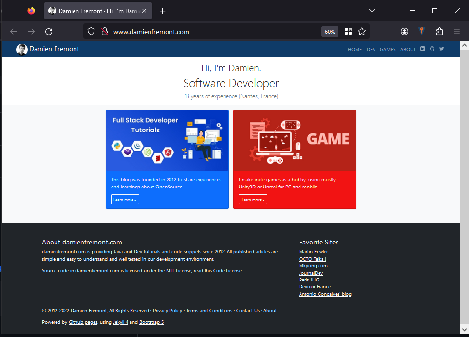

damienfremont.github.io
=======================

Official website (static) 
- http://damienfremont.com




----

# Getting started

- install ruby 2 rubyinstaller-devkit-2.7.5-1-x64.exe from https://rubyinstaller.org/downloads/

````bash
gem install jekyll -v '3.9.5'
gem install bundler -v '1.17.3'
bundle install
````

# Usage

Build and hot reload.

````bash
bundle exec jekyll serve --watch
````

http://127.0.0.1:4000/

# Release

````bash
git checkout main
git push
----

https://www.damienfremont.com/

# Project

|  Stack   |                Tools |
| :------: | -------------------: |
| Language | HTML, Markdown, Ruby |
|    UI    |     Bootstrap 5, CSS |
|   App    |             Jekyll 4 |

|     Feature     |              State |
| :-------------: | -----------------: |
|      post       | :heavy_check_mark: |
|    template     | :heavy_check_mark: |
|     navbar      | :heavy_check_mark: |
|     palette     | :heavy_check_mark: |
|      blog       | :heavy_check_mark: |
|      tags       | :heavy_check_mark: |
|   categories    | :heavy_check_mark: |
|   pagination    | :heavy_check_mark: |
|   text-limit    | :heavy_check_mark: |
|  links-widget   | :heavy_check_mark: |
|   top-widget    | :heavy_check_mark: |
| latests-widget  |         :no_entry: |
|       bio       |         :no_entry: |
|     author      | :heavy_check_mark: |
|  github-ribbon  | :heavy_check_mark: |
|  breadcrumb     |                :x: |
|    analytic     |                :x: |
|     search      |                :x: |
|      video      |                :x: |
|  share-widget   |                :x: |
| infinite-scroll |         :no_entry: |
|    comments     |         :no_entry: |
|    thumbnail    |         :no_entry: |
|     sitemap     |                :x: |
|       seo       |                :x: |
|    redirect     | :heavy_check_mark: |

|     Content      |              State |
| :--------------: | -----------------: |
|    home page     | :heavy_check_mark: |
|    terms page    | :heavy_check_mark: |
|     dev page     | :heavy_check_mark: |
|      posts       | :heavy_check_mark: |
|      medias      | :heavy_check_mark: |
|    blog page     | :heavy_check_mark: |
|    about page    | :heavy_check_mark: |
|    games page    |          :warning: |
|     404 page     | :heavy_check_mark: |
|     cv page      |                :x: |
|    game page     |                :x: |
| comments archive |                :x: |
|   socials page   |                :x: |
|    demos page    |         :no_entry: |
|   support page   |         :no_entry: |
|   contact page   |         :no_entry: |

# Resources

- Examples
  - Portfolio
    - https://webflow.com/blog/design-portfolio-examples
    - https://nad.is/
- Style
  - svg
    - https://iconmonstr.com/linkedin-3-svg/
  - palettes
    - http://colormind.io/bootstrap/
  - css
    - text limit https://www.codegrepper.com/code-examples/css/css+text+limit 
  - code
    - https://jekyllrb.com/docs/liquid/tags/#code-snippet-highlighting
    - https://github.com/jwarby/jekyll-pygments-themes
- Bootstrap
  - https://getbootstrap.com/docs/5.1/getting-started/introduction/
  - override vars
    - https://css-tricks.com/quick-and-dirty-bootstrap-overrides-at-runtime/
- Jekyll
  - themes
    - https://jekyllrb.com/docs/themes/
  - tags and categs and drafts
    - post  https://jekyllrb.com/docs/posts/
    - index https://jekyllrb.com/docs/plugins/generators/
  - pagination
    - https://jekyllrb.com/docs/pagination/
  - thumbnail for perf
    - https://superterran.net/jekyll-thumbnail/

- GitHub pages
  - plugins https://pages.github.com/versions/

# References

- design
  - Menu
    - search
  - Privacy https://www.journaldev.com/privacy-policy
  - Terms https://www.journaldev.com/terms-and-conditions
  - Dev
    - layouts
      - Post https://www.journaldev.com/python-tutorial
        - https://jamstackthemes.dev/theme/jekyll-theme-serial-programmer/
        - https://mkyong.com/java/java-lang-classnotfoundexception-com-sun-xml-bind-v2-contextfactory/
      - index
        - https://jamstackthemes.dev/demo/theme/jekyll-atlantic/
      - tutorials
    - includes
      - links
      - tops
      - bio include
        - https://jamstackthemes.dev/demo/theme/jekyll-atlantic/
  - Pro
    - layouts
      - About page  https://online-cv.webjeda.com/
  - Games 
    - layouts
      - game http://www.thefirsttree.com/
      - index
      - demo
      - presskit
      - privacy
      - term of services
      - ads.txt ?
    - includes
